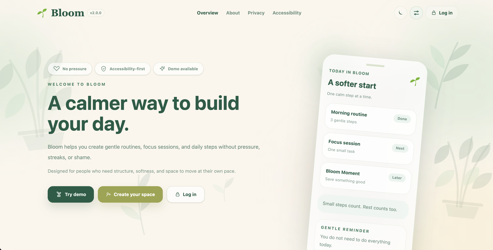
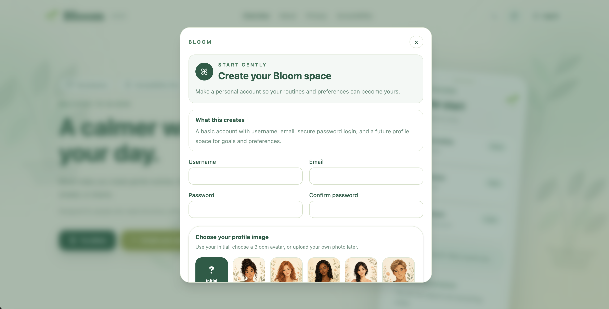
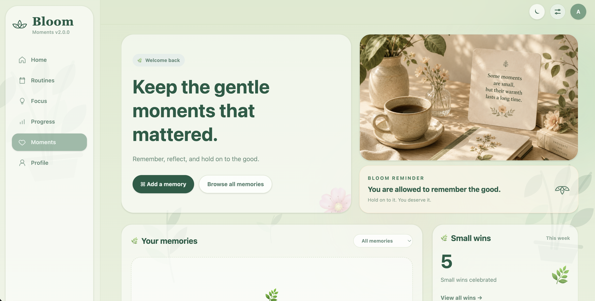
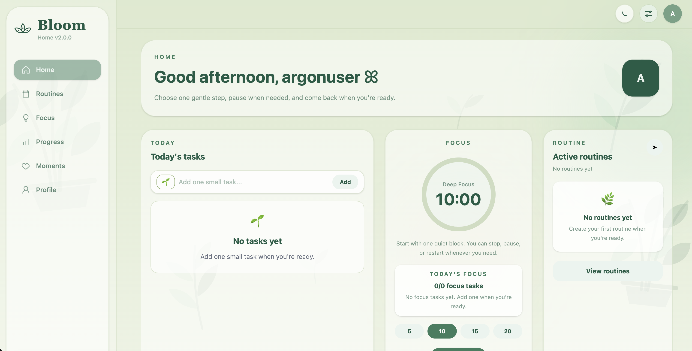
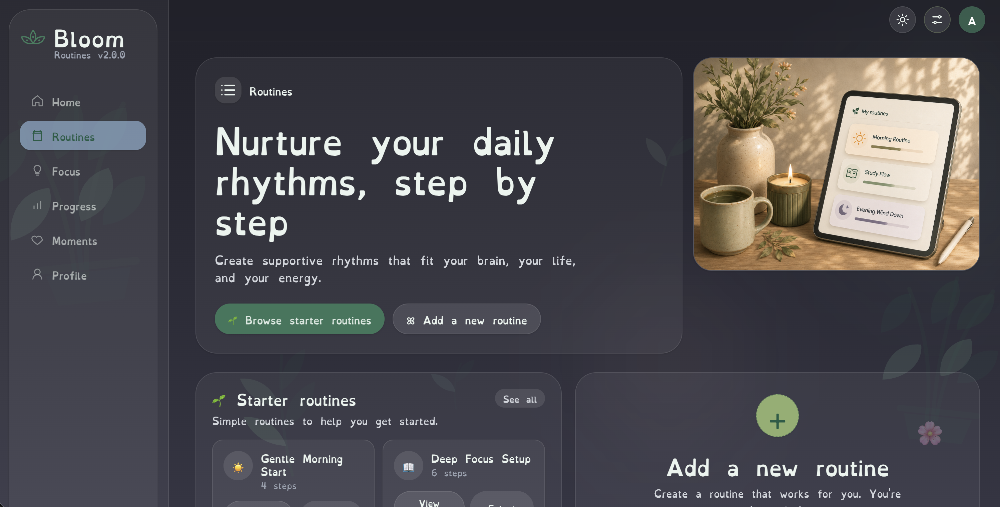
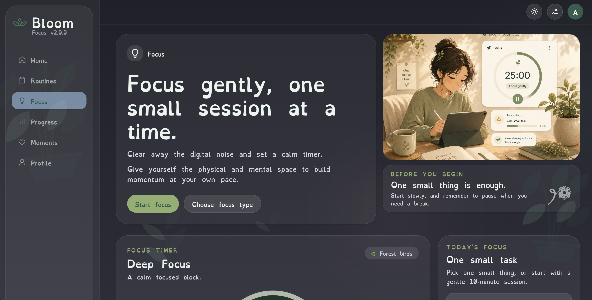

# Bloom 🌱

Calm routines for every brain.

Bloom is an active full-stack capstone project focused on building a calm, accessible visual routine and task sequencing app. It helps users create, organise, and follow step-by-step routines in a clear, supportive, and neurodivergent-friendly way.

Bloom currently focuses on **Bloom Personal**: a personal routine, focus, progress, and task support app being prepared for public beta feedback.

## Live Demo

[Experience Bloom](https://bloom-app-three-xi.vercel.app/)

## Screenshots

<table>
  <tr>
    <td>
      
      <br/>
      <strong>Public Overview</strong>
    </td>
    <td>
      
      <br/>
      <strong>Create Account Modal</strong>
    </td>
  </tr>
  <tr>
    <td>
      
      <br/>
      <strong>Moments</strong>
    </td>
    <td>
      
      <br/>
      <strong>Home</strong>
    </td>
  </tr>
  <tr>
    <td>
      
      <br/>
      <strong>Routines - Dark Mode</strong>
    </td>
    <td>
      
      <br/>
      <strong>Focus - Dark Mode</strong>
    </td>
  </tr>
</table>

## Current Status

Bloom has completed the public Overview v2 refresh and is now moving into the **v2.1.0 authentication phase**.

Recent completed work includes:

- Public Overview v2 redesign
- Login and create account modal polish
- Public About, Privacy, and Accessibility page updates
- Public and protected header layout separation
- Protected app sidebar/header layout restoration
- Moments v1.1.0 UI polish
- Favorite Quote card overlap fix
- Horizontal avatar picker
- Page Controls available across public and protected pages
- Backend security/configuration improvements for JWT and CORS

Next development focus:

- Stable login, account creation, and logout flow
- Restore current user on refresh
- Protect app pages from unauthenticated access
- Keep demo mode separate from real account data
- Save selected avatar per user
- Improve loading and error states

## Current Features

| Feature | Status |
|---|---|
| Public Overview landing page | Complete |
| Demo mode entry from Overview | Complete |
| Login/create account modal UI | In progress |
| Desktop sidebar and mobile navigation | Complete |
| Routines, tasks, focus, and progress pages | Complete |
| Moments dashboard | Complete |
| Favorite Quote card polish | Complete |
| Horizontal avatar picker | Complete |
| Light/dark mode | Complete |
| Text size controls | Complete |
| OpenDyslexic font toggle | Complete |
| Reduce motion setting | Complete |
| Public About, Privacy, and Accessibility pages | Complete |
| Backend auth/config hardening | In progress |

## Tech Stack

### Frontend

- React
- JavaScript
- Tailwind CSS
- Vite
- Vercel

### Backend

- Python
- FastAPI
- JWT authentication configuration
- Environment-based CORS configuration
- Python virtual environment setup

### Development Tools

- Git / GitHub
- VS Code
- Claude Code
- Codex
- ChatGPT

## AI-Assisted Development Workflow

Bloom includes supervised AI-assisted development as part of the engineering workflow.

AI tools were used for:

- Code review support
- Security and configuration checks
- Git diff review
- Debugging guidance
- README and documentation drafting
- Refactoring suggestions
- Frontend UI polish planning

AI-generated suggestions were reviewed, tested, and committed manually. Final implementation decisions, testing, Git workflow, and project direction were handled by the developer.

## Run Locally

```bash
git clone https://github.com/Iris408/bloom-app.git
cd bloom-app
npm install
npm run dev
```

Build check:

```bash
npm run build
```

The app runs locally with Vite, usually at:

```text
http://localhost:5173
```

## Documentation

More detailed notes are available in the `/docs` folder:

- [Beta Notes](./docs/bloom-beta-notes.md)
- [Backend Security and Configuration](./docs/bloom-security-config.md)
- [AI-Assisted Workflow](./docs/bloom-ai-workflow.md)
- [Japanese Summary](./docs/bloom-japanese-summary.md)

## Planned Features

- v2.1.0 authentication flow and user session handling
- Backend-connected feedback storage
- Database persistence for routines, tasks, focus items, moments, and profile settings
- Saved avatar and accessibility preferences per user
- Onboarding flow
- Mood check-in at app open
- Short version of routines
- Oasis calm reset space
- Low demand mode
- Exportable progress CSV
- Future full-stack deployment

## Author

Built by Iris408