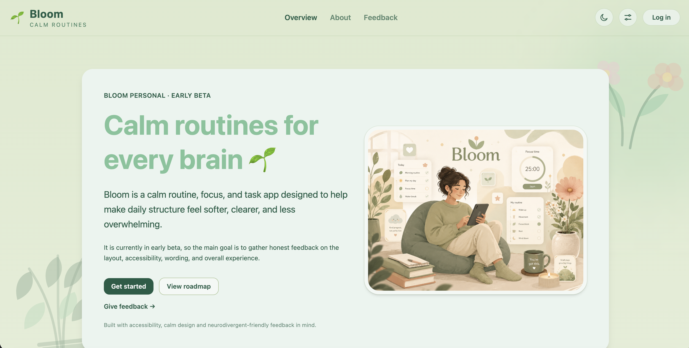
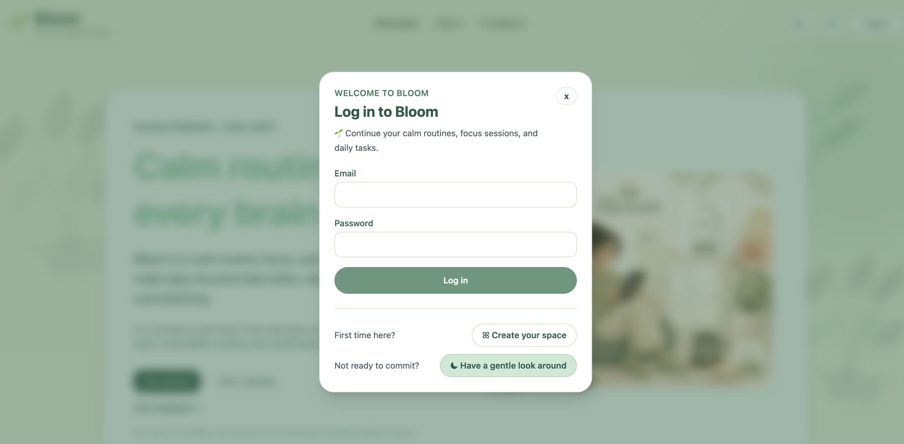
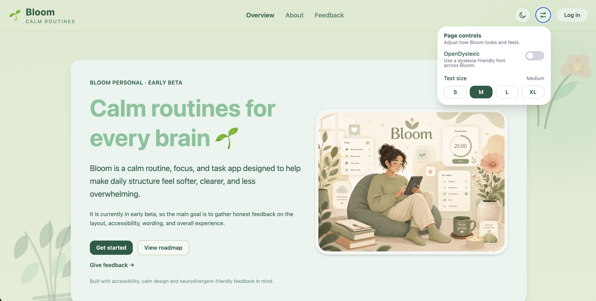
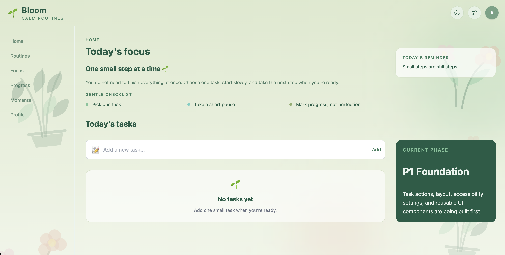
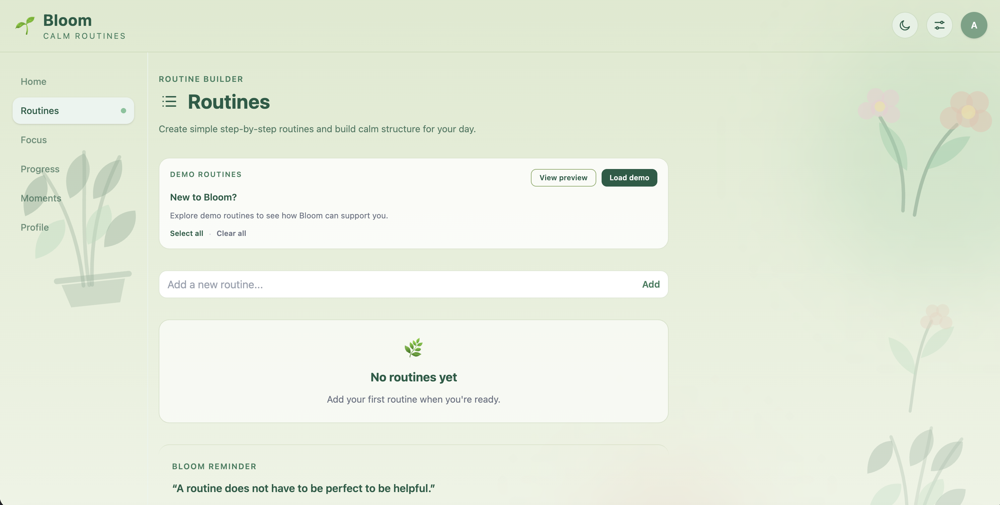
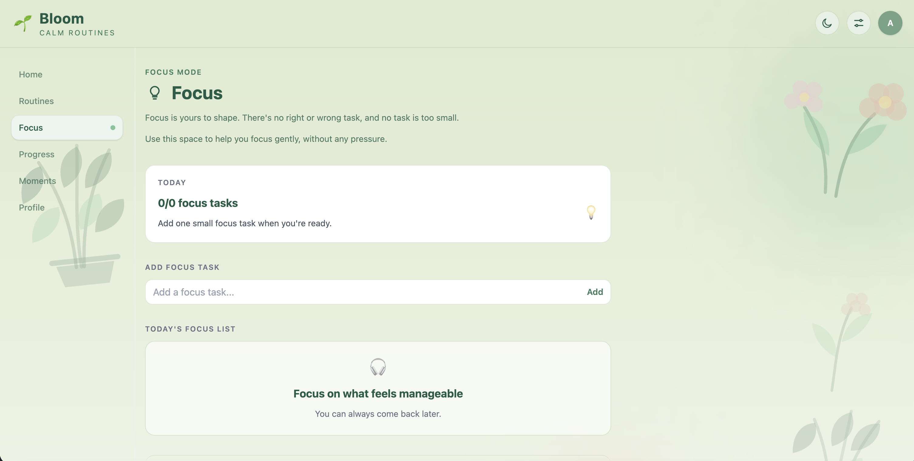

# Bloom 🌱

Calm routines for every brain.

Bloom is an active full-stack capstone project focused on building a calm, accessible visual routine and task sequencing application. The app is designed to help users create, organise, and follow step-by-step routines in a clear, supportive, and neurodivergent-friendly way.

Bloom currently focuses on **Bloom Personal**, a personal routine, focus, and task support app. The current version is being prepared for public beta feedback with a public Overview page, login modal flow, accessibility page controls, visual identity polish, and gentle feedback collection.

すべての人にやさしい、落ち着いたルーティン管理アプリ。

Bloomは、視覚的なルーティン作成とタスク進行を支援するアクセシビリティ重視のフルスタック・キャップストーンプロジェクトです。ユーザーがステップごとのルーティンを分かりやすく作成・整理・実行できるように設計しており、ニューロダイバージェントフレンドリーな体験を重視しています。

現在は、個人利用向けの **Bloom Personal** を中心に開発しています。現バージョンでは、公開用Overviewページ、ログインモーダル、アクセシビリティ用Page Controls、ビジュアルデザインの改善、ベータフィードバック収集に向けた調整を進めています。

## Project Overview / プロジェクト概要

Bloom is being built as a web-first visual task sequencer and routine builder. The first version focuses on **Bloom Personal**, a personal-use routine app with accessible layouts, task cards, routine pages, progress tracking and multiple user modes.

The long-term vision is **Bloom Education**, which may expand the app into an educational platform for students, parents, teachers, and school administrators. This education phase is planned for the future after the personal version is complete and stable.

Bloomは、Webファーストの視覚的タスクシーケンサーおよびルーティンビルダーとして開発しています。最初のバージョンでは、個人利用向けの **Bloom Personal** に集中し、アクセシブルなレイアウト、タスクカード、ルーティンページ、進捗管理、複数の利用モードを構築していきます。

長期的には、学生、保護者、教師、学校管理者向けの教育プラットフォームである **Bloom Education** への拡張も視野に入れています。この教育向けフェーズは、個人版が安定した後の将来的な計画です。

## Live Demo - [Experience Bloom](https://bloom-app-three-xi.vercel.app/)

### Latest Beta Updates

Recent Bloom beta updates include:

- Public landing page redesigned around the Bloom v2.0.0 product vision
- Improved landing page CTAs for demo, account creation, and login
- Updated About page with a more personal product journey and design values
- Frontend beta feedback form added
- Feedback is currently saved locally using localStorage
- Footer updated with Product, Company, and Trust links
- Demo mode and public-page layout polish

Backend-connected feedback collection, full account creation, and deeper onboarding are planned for later versions.

### Screenshots / スクリーンショット

<table>
  <tr>
    <td>
      
       
      <strong>Public Overview / 公開概要ページ</strong>
    </td>
    <td>
      
       
      <strong>Login Modal / ログインモーダル</strong>
    </td>
  </tr>
  <tr>
    <td>
      
       
      <strong>Page Controls / ページ表示設定</strong>
    </td>
    <td>
      
       
      <strong>Home / ホーム</strong>
    </td>
  </tr>
  <tr>
    <td>
      
       
      <strong>Routines / ルーティン</strong>
    </td>
    <td>
      
       
      <strong>Focus / フォーカス</strong>
    </td>
  </tr>
</table>

## Current Status / 現在のステータス

### v1.1.0 Protected App Refresh

This update focuses on improving the logged-in Bloom experience after the public/auth integration work. Home, Routines, and Focus now have stronger visual consistency, calmer interaction patterns, and more complete user flows.

Progress and Moments remain planned for the next Bloom sprint

### v1.6.1 - 保護されたアプリのリフレッシュ

このアップデートは、公開／認証統合後のログイン済みBloom体験の改善に焦点を当てています。Home、Routines、Focusは、より一貫したビジュアル、落ち着いたインタラクションパターン、
そしてより完全なユーザーフローを備えるようになりました。

ProgressとMomentsは、次のBloomスプリントでの対応を予定しています

### Latest Beta Updates / 最新ベータ更新

Bloom’s public beta experience has been polished with a redesigned landing page, improved CTA modal routing, updated About/Privacy/Accessibility pages, a frontend beta feedback form, mobile layout improvements, and footer navigation that returns users to the top of each page.

Feedback is currently stored locally with localStorage. Full account creation, backend-connected feedback, saved user data, and deeper onboarding are planned for later versions.

Small beta polish is focused on stabilising the public landing flow, demo mode, feedback form, mobile layout, and public trust pages before returning to the remaining Bloom v2.0.0 work.

Bloom の公開ベータ体験を改善しました。新しいランディングページ、CTA ボタンから正しいモーダル画面へ移動する導線、About / Privacy / Accessibility ページの更新、フロントエンドのベータフィードバックフォーム、モバイルレイアウトの改善、そしてフッターリンクをクリックしたときに各ページの一番上から表示されるナビゲーションを追加しました。

現在、フィードバックは localStorage を使ってブラウザ内にローカル保存されます。完全なアカウント作成、バックエンド連携のフィードバック保存、ユーザーデータの保存、より深いオンボーディング機能は、今後のバージョンで追加予定です。

小さなベータ版の仕上げでは、Bloom v2.0.0 の残り作業に戻る前に、公開ランディングページ、デモモード、フィードバックフォーム、モバイルレイアウト、公開向けの信頼性ページを安定させることに集中しています。

## Current Features / 現在の機能

| EN | 日本語 | EN | 日本語 |
|---|---|---|---|
| Desktop sidebar and Mobile bottom navigation | デスクトップ用サイドバーナビゲーション/モバイル用ボトムナビゲーション | Empty state microcopy improvements | 空状態メッセージの改善 |
| Reusable Bloom button components | 再利用可能なBloomボタンコンポーネント | Public Overview landing page | 公開用Overviewランディングページ |
| Task card and task list components | タスクカード・タスクリストコンポーネント | Login modal overlay | ログインモーダル表示 |
| Emoji picker for new and edited tasks | 新規作成・編集タスク用の絵文字ピッカー | Public About, Privacy, and Accessibility pages | 公開用 About / Privacy / Accessibility ページ |
| Completed task styling with tick and line-through state | チェック表示と取り消し線による完了タスク表示 | Google feedback form link for beta feedback | ベータフィードバック用Googleフォームリンク |
| Selectable demo routine preview | 選択可能なデモルーティンプレビュー | Header Page Controls dropdown | Header の Page Controls ドロップダウン |
| Load selected demo routines only | 選択したデモルーティンのみ読み込み | Text size controls from S to XL | S〜XL の文字サイズ設定 |
| Global app context structure | グローバルアプリコンテキスト構成 | Light and dark mode | ライトモード・ダークモード |
| Reusable UI component folder | 再利用可能なUIコンポーネントフォルダ | OpenDyslexic font, Reduce motion toggle | OpenDyslexicフォント切り替え /アニメーション軽減設定|
| Reusable empty state component | 再利用可能な空状態コンポーネント | Daily reset behaviour for tasks, routines, routine steps and focus tasks | タスク、ルーティン、ルーティンステップ、集中タスクの日次リセット |

## Core Goals / 主な目標

| EN | 日本語 |
|---|---|
| Build a calm and accessible routine-building app | 落ち着いて使えるアクセシブルなルーティン作成アプリを構築 |
| Support neurodivergent-friendly user experiences | ニューロダイバージェントフレンドリーなユーザー体験を支援 |
| Provide simple visual step-by-step task guidance | ステップごとの視覚的なタスク案内を提供 |
| Include kid-friendly and adult-friendly modes | 子ども向け・大人向けのモードに対応 |
| Design layouts that work well on desktop and mobile | デスクトップとモバイルの両方で使いやすいレイアウトを設計 |
| Build a strong portfolio-ready full-stack capstone project | ポートフォリオに掲載できるフルスタック・キャップストーンとして成長させる |

## Planned Features / 今後の予定機能

| EN | 日本語 |
|---|---|
| Onboarding flow | オンボーディングフロー |
| Mood check-in at app open | アプリ起動時の気分チェックイン |
| Short version of routines | ルーティンの短縮版 |
| Oasis calm reset space | Oasis という落ち着いたリセット空間 |
| Time estimates per routine step | ルーティンステップごとの所要時間目安 |
| Missed-day recovery wording | できなかった日の回復を支えるメッセージ |
| Low demand mode | 低負荷モード |
| Exportable progress CSV | 進捗CSVエクスポート |
| Dedicated in-app Feedback page | 専用のアプリ内フィードバックページ |
| Additional accessibility features | その他のアクセシビリティ機能 |
| Persisted user accessibility preferences | ユーザーごとのアクセシビリティ設定保存 |
| v2.0.0 full-stack backend with authentication and database persistence | 認証とデータベース永続化を含む v2.0.0 フルスタックバックエンド |
| Future full-stack deployment | 将来的なフルスタックデプロイ |

## Tech Stack / 技術スタック

### Current Frontend / 現在のフロントエンド

- React
- JavaScript
- Tailwind CSS
- Vite
- Vercel
- Git/GitHub

## Author
Built by Iris408
