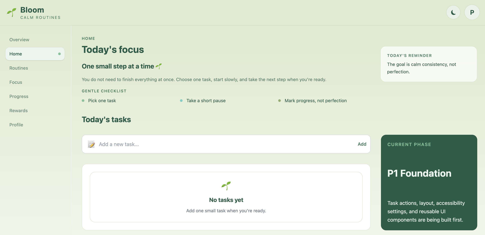
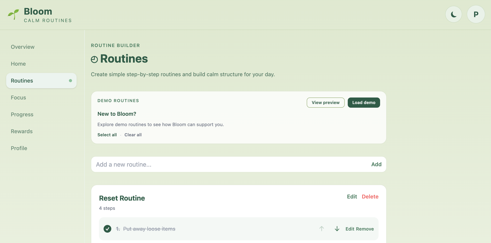
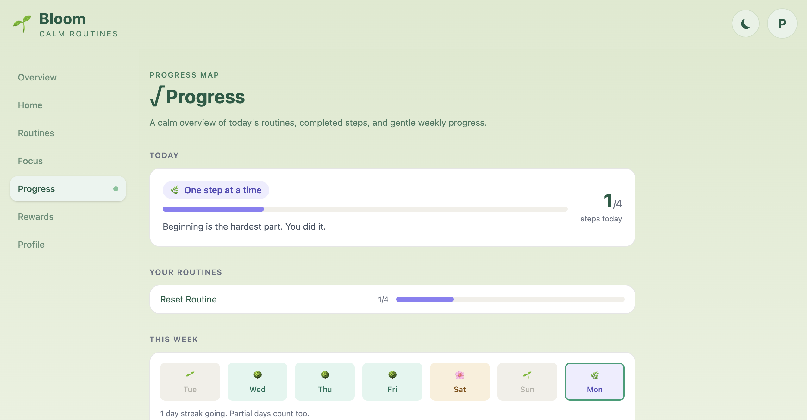
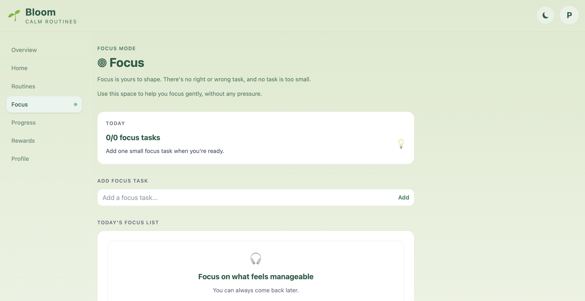

# Bloom 🌱

Calm routines for every brain.

Bloom is an active full-stack capstone project focused on building a calm, accessible visual routine and task sequencing application. The app is designed to help users create, organise, and follow step-by-step routines in a clear, supportive, and neurodivergent-friendly way.

# Bloom 🌱

すべての人にやさしい、落ち着いたルーティン管理アプリ。

Bloomは、視覚的なルーティン作成とタスク進行を支援するアクセシビリティ重視のフルスタック・キャップストーンプロジェクトです。ユーザーがステップごとのルーティンを分かりやすく作成・整理・実行できるように設計しており、ニューロダイバージェントフレンドリーな体験を重視しています。

## Live Demo

[View Bloom on Vercel](https://bloom-app-three-xi.vercel.app/)

## Screenshots / スクリーンショット

<table>
  <tr>
    <td>
      
       
      <strong>Bloom Home/ホーム</strong>
    </td>
    <td>
      
       
      <strong>Routines/ルーティン</strong>
    </td>
  </tr>
  <tr>
    <td>
      
       
      <strong>Progress/プログレス</strong>
    </td>
    <td>
      
       
      <strong>Focus Mode/フォーカス</strong>
    </td>
  </tr>
</table>

## Current Status / 現在のステータス

**Active Capstone Project / Frontend MVP v1.2.0 Complete**

**アクティブなキャップストーンプロジェクト / フロントエンドMVP v1.2.0完了**

* Bloom is currently a frontend MVP focused on calm routine building, task completion, focus task tracking, demo routine onboardimg, daily reminders and visual progress feedback. The app uses React, Vite, Tailwind CSS, reusable components, and localStorage persistence.
* Bloomは現在、穏やかなルーティン作成、タスク完了管理、集中タスクの追跡、デモルーティンのオンボーディング、デイリーリマインダー、安心できる進捗フィードバックに重点を置いたフロントエンドMVPです。このアプリは、React、Vite、Tailwind CSS、再利用可能なコンポーネント、そしてlocalStorageによるデータストレージを利用しています。

## Version Update — v1.2.0 / バージョン更新 — v1.2.0

* Bloom v1.2.0 adds several usability improvements focused on task completion, gentle daily encouragement, and demo routine onboarding.

* Bloom v1.2.0では、タスク完了管理、やさしいデイリーリマインダー、デモルーティンのオンボーディングを中心に、使いやすさを改善しました。

### User Experience Improvements

Bloom now gives users a clearer onboarding flow for trying demo routines. Users can preview available routines, select one or more routines, load only the routines they want, and continue editing them as normal routine cards. The demo preview also closes automatically after loading, and selected ticks reset so the interface stays clean.

### UX改善
Bloomでは、デモルーティンを試すためのオンボーディング体験がより分かりやすくなりました。ユーザーは利用可能なルーティンをプレビューし、1つまたは複数のルーティンを選択し、必要なものだけを読み込み、その後は通常のルーティンカードとして編集できます。デモプレビューは読み込み後に自動で閉じ、選択済みチェックもリセットされるため、画面がすっきりした状態を保てます。

| Area | Status |
|---|---|---|---|
| **Foundation** | | **Progress** | |
| Vite + React, folder structure, routing | ✅ Complete | Progress v1 - calm routine progress overview | ✅ Complete |
| Sidebar navigation for desktop and bottom navigation | ✅ Complete | Pre-routine progress bars and weekly progress snapshots | ✅ Complete |
| Header, footer, reusable UI components | ✅ Complete | Descriptive progress labels | ✅ Complete |
| **Tasks** | | **UI / UX** | |
| Task cards, task list, CRUD actions and emoji picker | ✅ Complete | Light/dark mode and accessibility controls | ✅ Complete |
| Task localStorage persistence | ✅ Complete | Reusable Bloom reminder component across pages | ✅ Complete |
| Reusable task completion button | ✅ Complete | Daily affirmation/reminder card | ✅ Complete |
| Completed task styling with tick and line-through state | ✅ Complete | Better mobile-friendly layout improvements | ✅ Complete |
| **Routines** | | **Planned Updates** | |
| Routine builder — create, edit and delete routines | ✅ Complete | v1.3.0 Daily reset behaviour | 🚧 Planned |
| Routine steps — add, remove, edit, reorder and complete | ✅ Complete | v1.4.0 Empty state microcopy improvements | 🚧 Planned |
| Routine and step localStorage persistence | ✅ Complete | Rewards page v1 | 🚧 Planned |
| Demo routine data stored in `src/data/demoData.js` | ✅ Complete | Profile settings persistence | 🚧 Planned |
| Auto-close preview and reset selected ticks after loading | ✅ Complete | Backend API and database persistence | 🚧 Planned |
| Load only selected demo routines | ✅ Complete | Future full-stack deployment | 🚧 Planned
| **Focus Mode** | |
| Focus v1 - add, complete and remove daily focus tasks | ✅ Complete |
| Focus task localStorage persistence | ✅ Complete |

## Project Overview / プロジェクト概要

Bloom is being built as a web-first visual task sequencer and routine builder. The first version focuses on **Bloom Personal**, a personal-use routine app with accessible layouts, task cards, routine pages, progress tracking, rewards, and multiple user modes.

The long-term vision is **Bloom Education**, which may expand the app into an educational platform for students, parents, teachers, and school administrators. This education phase is planned for the future after the personal version is complete and stable.

Bloomは、Webファーストの視覚的タスクシーケンサーおよびルーティンビルダーとして開発しています。最初のバージョンでは、個人利用向けの **Bloom Personal** に集中し、アクセシブルなレイアウト、タスクカード、ルーティンページ、進捗管理、リワード、複数の利用モードを構築していきます。

長期的には、学生、保護者、教師、学校管理者向けの教育プラットフォームである **Bloom Education** への拡張も視野に入れています。この教育向けフェーズは、個人版が安定した後の将来的な計画です。

## Core Goals / 主な目標

| EN | 日本語 |
|---|---|
| Build a calm and accessible routine-building app | 落ち着いて使えるアクセシブルなルーティン作成アプリを構築 |
| Support neurodivergent-friendly user experiences | ニューロダイバージェントフレンドリーなユーザー体験を支援 |
| Provide simple visual step-by-step task guidance | ステップごとの視覚的なタスク案内を提供 |
| Include kid-friendly and adult-friendly modes | 子ども向け・大人向けのモードに対応 |
| Design layouts that work well on desktop and mobile | デスクトップとモバイルの両方で使いやすいレイアウトを設計 |
| Build a strong portfolio-ready full-stack capstone project | ポートフォリオに掲載できるフルスタック・キャップストーンとして成長させる |

## Current Features / 現在の機能

| EN | 日本語 |
|---|---|
| React app structure created with Vite | Viteで作成したReactアプリ構成 |
| Component-based folder structure | コンポーネントベースのフォルダ構成 |
| Desktop sidebar and Mobile bottom navigation | デスクトップ用サイドバーナビゲーション/モバイル用ボトムナビゲーション |
| Header and footer components | ヘッダー・フッターコンポーネント |
| Reusable Bloom button component | 再利用可能なBloomボタンコンポーネント |
| Task card and task list components | タスクカード・タスクリストコンポーネント |
| Emoji picker for new and edited tasks | 新規作成・編集タスク用の絵文字ピッカー |
| Completed task styling with tick and line-through state | チェック表示と取り消し線による完了タスク表示 |
| Selectable demo routine preview | 選択可能なデモルーティンプレビュー |
| Select all and Clear all demo routine controls | デモルーティン用の Select all / Clear all 操作 |
| Load selected demo routines only | 選択したデモルーティンのみ読み込み |
| Auto-close demo preview after loading | 読み込み後にデモプレビューを自動で閉じる機能 |
| Reset selected demo routine ticks after loading | 読み込み後に選択チェックを自動でリセット |
| Global app context structure | グローバルアプリコンテキスト構成 |
| Reusable UI component folder | 再利用可能なUIコンポーネントフォルダ |
| Light and dark mode | ライトモード・ダークモード |
| Font size controls | フォントサイズ調整 |
| OpenDyslexic font, Reduce motion toggle | OpenDyslexicフォント切り替え /アニメーション軽減設定|

## Pages / ページ構成

| Page | Purpose | ページ | 目的 |
|---|---|---|---|
| Overview | High-level app overview | 概要 | アプリ全体の概要 |
| Home | Today’s focus, task list, task completion and daily reminder | 今日のフォーカス、タスクリスト、タスク完了、デイリーリマインダー |
| Routines | Routine builder, routine steps and selectable demo routines | ルーティン | ルーティン作成、ステップ管理、選択可能なデモルーティン |
| Focus | Daily focus task tracking | フォーカス | 日々の集中タスク管理 |
| Progress | Calm progress overview and weekly snapshots | プログレス | 落ち着いた進捗概要と週間スナップショット |
| Rewards | Placeholder page for future rewards and badges | リワード | 今後のリワード・バッジ用プレースホルダーページ |
| Profile | Placeholder page for future user settings and accessibility preferences | プロフィール | 今後のユーザー設定・アクセシビリティ設定用プレースホルダーページ |

## Planned Features / 今後の予定機能

| EN | 日本語 |
|---|---|
| Daily reset behaviour for tasks, routines, routine steps and focus tasks | タスク、ルーティン、ルーティンステップ、集中タスクの日次リセット |
| Empty state microcopy improvements | 空状態メッセージの改善 |
| Wins-only progress view | 達成したことだけを見る進捗ビュー |
| Time estimates per routine step | ルーティンステップごとの所要時間目安 |
| Low demand mode | 低負荷モード |
| Notification/reminder setting | 通知・リマインダー設定 |
| Mood check-in at app open | アプリ起動時の気分チェックイン |
| Short version of routines | ルーティンの短縮版 |
| Onboarding flow | オンボーディングフロー |
| Ambient audio toggle | 環境音の切り替え |
| Exportable progress CSV | 進捗CSVエクスポート |
| Future FastAPI backend | 将来的なFastAPIバックエンド |
| Future database persistence | 将来的なデータベース永続化 |
| Future full-stack deployment | 将来的なフルスタックデプロイ |

## App Modes / アプリモード

| Mode | Purpose | モード | 目的 |
|---|---|---|---|
| Standard Mode | Clean adult-friendly layout for personal routines | スタンダードモード | 個人ルーティン向けのシンプルで大人向けのレイアウト |
| Kid Mode | Simplified, warmer, emoji-heavy experience for children | キッズモード | 子ども向けの分かりやすく温かい絵文字中心のUI |
| Focus Mode | One step shown at a time to reduce distraction | フォーカスモード | 気が散りにくいように1ステップずつ表示 |
| Calm Mode | Softer interface with reduced motion and urgency | リラックスモード | 動きや緊急感を抑えた落ち着いたUI |
| Review Mode | Reflection after completing a routine | レビューモード | ルーティン完了後の振り返り |
| Education Mode | Long-term future mode for school-based use | 学習・学校モード | 将来的な学校・教育向け利用モード |

## Tech Stack / 技術スタック

### Current Frontend / 現在のフロントエンド

- React
- JavaScript
- Tailwind CSS
- Vite
- Vercel
- Git/GitHub

