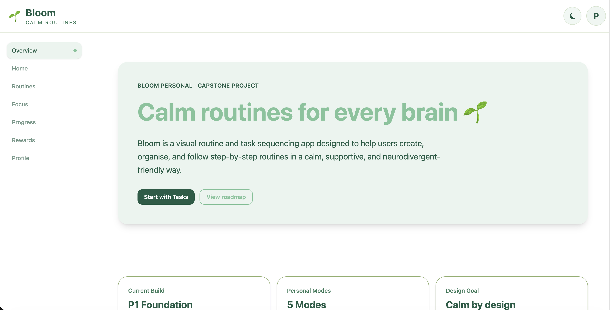

# Bloom 🌱

Calm routines for every brain.

Bloom is an active full-stack capstone project focused on building a calm, accessible visual routine and task sequencing application. The app is designed to help users create, organise, and follow step-by-step routines in a clear, supportive, and neurodivergent-friendly way.

# Bloom 🌱

すべての人にやさしい、落ち着いたルーティン管理アプリ。

Bloomは、視覚的なルーティン作成とタスク進行を支援するアクセシビリティ重視のフルスタック・キャップストーンプロジェクトです。ユーザーがステップごとのルーティンを分かりやすく作成・整理・実行できるように設計しており、ニューロダイバージェントフレンドリーな体験を重視しています。

## Screenshot / スクリーンショット



## Current Status / 現在のステータス

**Active Capstone Project / Frontend Foundation + Task Persistence**

**アクティブなキャップストーンプロジェクト / フロントエンド基礎構築フェーズ**

| Area | Status |
|---|---|
| React + Vite frontend structure | ✅ Complete |
| Component-based folder structure | ✅ Complete |
| Desktop sidebar navigation | ✅ Complete |
| Mobile bottom navigation | ✅ Complete |
| Header and footer layout | ✅ Complete |
| Reusable Bloom button and reminder components | ✅ Complete |
| Task card and task list components | ✅ Complete |
| Add, edit, save, cancel, and delete task actions | ✅ Complete |
| Emoji picker for new and edited tasks | ✅ Complete |
| Light and dark mode support | ✅ Complete |
| Accessibility controls | ✅ Complete |
| localStorage task and routine persistence | ✅ Complete  |
| Routine builder v1 | ✅ Complete  |
| Add, edit, delete routine actions | ✅ Complete |
| Add and remove routine steps | ✅ Complete  |
| localStorage task persistence | ✅ Complete |
| Edit individual routine steps | ✅ Complete |
| Reorder routine steps with up/down controls | ✅ Complete |
| Mark routine steps complete/incomplete | 🚧 Next |
| Progress tracking | 🚧 Planned |
| Backend API | 🚧 Planned |
| Database persistence | 🚧 Planned |

## Project Overview / プロジェクト概要

Bloom is being built as a web-first visual task sequencer and routine builder. The first version focuses on **Bloom Personal**, a personal-use routine app with accessible layouts, task cards, routine pages, progress tracking, rewards, and multiple user modes.

The long-term vision is **Bloom Education**, which may expand the app into an educational platform for students, parents, teachers, and school administrators. This education phase is planned for the future after the personal version is complete and stable.

Bloomは、Webファーストの視覚的タスクシーケンサーおよびルーティンビルダーとして開発しています。最初のバージョンでは、個人利用向けの **Bloom Personal** に集中し、アクセシブルなレイアウト、タスクカード、ルーティンページ、進捗管理、リワード、複数の利用モードを構築していきます。

長期的には、学生、保護者、教師、学校管理者向けの教育プラットフォームである **Bloom Education** への拡張も視野に入れています。この教育向けフェーズは、個人版が安定した後の将来的な計画です。

## Core Goals / 主な目標

| EN | 日本語 |
|---|---|
| Build a calm and accessible routine-building app | 落ち着いて使えるアクセシブルなルーティン作成アプリを構築 |
| Support neurodivergent-friendly user experiences | ニューロダイバージェントフレンドリーなユーザー体験を支援 |
| Provide simple visual step-by-step task guidance | ステップごとの視覚的なタスク案内を提供 |
| Include kid-friendly and adult-friendly modes | 子ども向け・大人向けのモードに対応 |
| Design layouts that work well on desktop and mobile | デスクトップとモバイルの両方で使いやすいレイアウトを設計 |
| Build a strong portfolio-ready full-stack capstone project | ポートフォリオに掲載できるフルスタック・キャップストーンとして成長させる |

## Current Features / 現在の機能

| EN | 日本語 |
|---|---|
| React app structure created with Vite | Viteで作成したReactアプリ構成 |
| Component-based folder structure | コンポーネントベースのフォルダ構成 |
| Desktop sidebar navigation | デスクトップ用サイドバーナビゲーション |
| Mobile bottom navigation | モバイル用ボトムナビゲーション |
| Header and footer components | ヘッダー・フッターコンポーネント |
| Reusable Bloom button component | 再利用可能なBloomボタンコンポーネント |
| Task card and task list components | タスクカード・タスクリストコンポーネント |
| Emoji picker for new and edited tasks | 新規作成・編集タスク用の絵文字ピッカー |
| Task add, edit, save, cancel, and delete actions | タスクの追加、編集、保存、キャンセル、削除 |
| Main pages created | 主要ページの作成 |
| Global app context structure | グローバルアプリコンテキスト構成 |
| Reusable UI component folder | 再利用可能なUIコンポーネントフォルダ |
| Light and dark mode | ライトモード・ダークモード |
| Font size controls | フォントサイズ調整 |
| OpenDyslexic font toggle | OpenDyslexicフォント切り替え |
| Reduce motion toggle | アニメーション軽減設定 |

## Pages / ページ構成

| Page | Purpose |
|---|---|
| Overview | High-level app overview |
| Home | Today’s focus and task list |
| Routines | Future routine builder page |
| Focus | Future one-step-at-a-time mode |
| Progress | Future progress tracking |
| Rewards | Future rewards and badges |
| Profile | User settings and accessibility preferences |

### 日本語

| ページ | 目的 |
|---|---|
| 概要 | アプリ全体の概要 |
| ホーム | 今日のフォーカスとタスクリスト |
| ルーティン | 今後のルーティン作成ページ |
| フォーカス | 今後の1ステップ集中モード |
| プログレス | 今後の進捗管理 |
| リワード | 今後のリワード・バッジ |
| プロフィール | ユーザー設定とアクセシビリティ設定 |

## Planned Features / 今後の予定機能

| EN | 日本語 |
|---|---|
| Reorder routine steps | ルーティンステップの追加・編集・削除・並び替え |
| Progress tracking | 進捗管理 |
| Streaks, stars, and badges | 継続記録、スター、バッジ |
| Profile switching | プロフィール切り替え |
| Focus Mode | 1ステップずつ表示する集中モード |
| Kid Mode | 子ども向けモード |
| Calm Mode | 視覚的な刺激を抑えた落ち着いたモード |
| Review Mode | 完了後の振り返りモード |
| Future FastAPI backend | 将来的なFastAPIバックエンド |
| Future database persistence | 将来的なデータベース永続化 |
| Future mobile/iOS version | 将来的なモバイル/iOS版 |

## App Modes / アプリモード

| Mode | Purpose |
|---|---|
| Standard Mode | Clean adult-friendly layout for personal routines |
| Kid Mode | Simplified, warmer, emoji-heavy experience for children |
| Focus Mode | One step shown at a time to reduce distraction |
| Calm Mode | Softer interface with reduced motion and urgency |
| Review Mode | Reflection after completing a routine |
| Education Mode | Long-term future mode for school-based use |

### 日本語

| モード | 目的 |
|---|---|
| スタンダードモード | 個人ルーティン向けのシンプルで大人向けのレイアウト |
| キッズモード | 子ども向けの分かりやすく温かい絵文字中心のUI |
| フォーカスモード | 気が散りにくいように1ステップずつ表示 |
| リラックスモード | 動きや緊急感を抑えた落ち着いたUI |
| レビューモード | ルーティン完了後の振り返り |
| 学習・学校モード | 将来的な学校・教育向け利用モード |

## Tech Stack / 技術スタック

### Current Frontend / 現在のフロントエンド

- React
- JavaScript
- Tailwind CSS
- Vite
- CSS
- Git/GitHub

### Planned Backend / 今後のバックエンド予定

- Python
- FastAPI
- SQLite or TinyDB for early learning phase
- PostgreSQL for future production-ready versions

### Future Tools / 将来的に使用予定のツール

- React Native for iOS
- Vercel for frontend hosting
- Render for backend hosting

## Project Structure / プロジェクト構成

```text
bloom-app/
├── public/
│   └── fonts/
├── src/
│   ├── assets/
│   ├── components/
│   │   ├── layout/
│   │   │   ├── BottomNav.jsx
│   │   │   ├── Footer.jsx
│   │   │   ├── Header.jsx
│   │   │   └── Sidebar.jsx
│   │   ├── modes/
│   │   ├── tasks/
│   │   │   ├── TaskCard.jsx
│   │   │   └── TaskList.jsx
│   │   └── ui/
│   │       ├── Button.jsx
│   │       ├── DyslexicFontToggle.jsx
│   │       ├── FontSizeSlider.jsx
│   │       └── ReduceMotionToggle.jsx
│   ├── context/
│   │   └── AppContext.jsx
│   ├── pages/
│   │   ├── Focus.jsx
│   │   ├── Home.jsx
│   │   ├── Overview.jsx
│   │   ├── Profile.jsx
│   │   ├── Progress.jsx
│   │   ├── Rewards.jsx
│   │   └── Routines.jsx
│   ├── styles/
│   ├── App.css
│   ├── App.jsx
│   ├── index.css
│   └── main.jsx
├── .gitignore
├── eslint.config.js
├── index.html
├── package-lock.json
└── package.json
